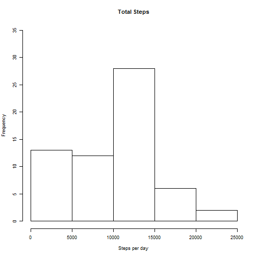
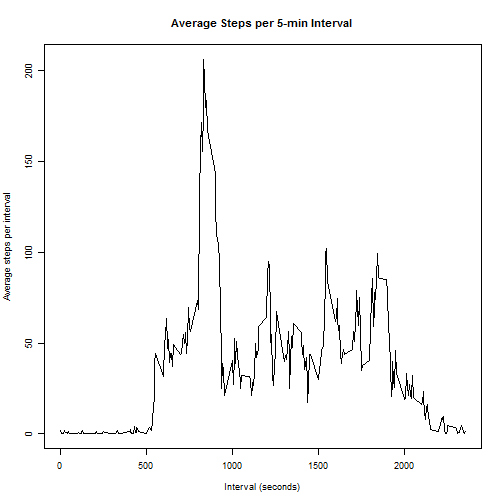
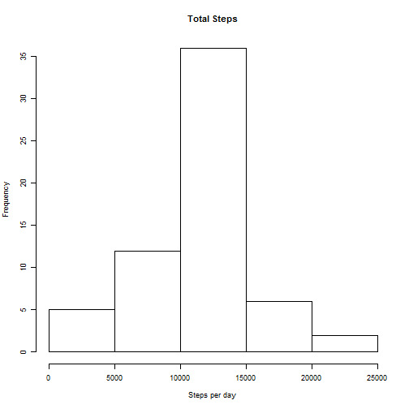

==================================================

Load the data for Activity Monitoring and update variable classes as necessary to enable further data analysis. 


```r
activity<-read.csv("activity.csv")
activity$steps<-as.numeric(activity$steps)
activity$date<-as.character(activity$date)
activity$date<-as.Date(activity$date, "%Y-%m-%d")
```


Calculate the total number of steps taken in a day, and plot a histogram to show the frequency distribution.


```r
library(plyr)
bydate<-ddply(activity,.(date), summarize, sumofsteps=sum(steps, na.rm=TRUE))
head(bydate)
```

```
##         date sumofsteps
## 1 2012-10-01          0
## 2 2012-10-02        126
## 3 2012-10-03      11352
## 4 2012-10-04      12116
## 5 2012-10-05      13294
## 6 2012-10-06      15420
```

```r
par(cex=0.75)
hist(bydate$sumofsteps, main="Total Steps", xlab="Steps per day",ylim=c(0,35))
```

 


Then calculate the mean and median total number of steps taken per day.


```r
meansteps<-mean(bydate$sumofsteps,na.rm=TRUE)
cat("Mean = ", meansteps)
```

```
## Mean =  9354.23
```

```r
mediansteps<-median(bydate$sumofsteps,na.rm=TRUE)
cat("Median = ", mediansteps)
```

```
## Median =  10395
```

------------------------------

Plot a time series of the 5-min interval and the average number of steps taken across all days.


```r
byinterval<-ddply(activity,.(interval),summarize,averagesteps=mean(steps,na.rm=TRUE))
par(cex=0.75)
with(byinterval,plot(interval,averagesteps,main="Average Steps per 5-min Interval",xlab="Interval (seconds)",ylab="Average steps per interval",type="l"))
```

 


Return the 5-min interval that contains the maximum number of steps, on average across all days.


```r
maxsteps<-byinterval[order(-byinterval$averagesteps),]
cat("Interval with maximum number of steps = ",maxsteps[1,1])
```

```
## Interval with maximum number of steps =  835
```

```r
cat("Average number of steps in that interval = ",maxsteps[1,2])
```

```
## Average number of steps in that interval =  206.1698
```

--------------------------------

Calculate and report the total number of missing values in the dataset.


```r
isNA<-sum(is.na(activity$steps))
cat("NA = ", isNA)
```

```
## NA =  2304
```


Use the mean of the 5-min interval across days to fill in the missing values in the dataset. Create a new dataset, which shall be named activity2, which is equal to the original dataset but has the missing data filled in. 


```r
activity_merge<-merge(activity,byinterval,by.x="interval",sort=FALSE)
activity_merge<-activity_merge[order(activity_merge$date),]
activity_merge$steps[is.na(activity_merge$steps)]<-activity_merge$averagesteps[is.na(activity_merge$steps)]
activity2<-activity_merge[,1:3]
head(activity2)
```

```
##     interval     steps       date
## 1          0 1.7169811 2012-10-01
## 63         5 0.3396226 2012-10-01
## 128       10 0.1320755 2012-10-01
## 205       15 0.1509434 2012-10-01
## 264       20 0.0754717 2012-10-01
## 327       25 2.0943396 2012-10-01
```


Using the new complete dataset, activity2, calculate the total number of steps taken in a day and plot a histogram to show the frequency distribution.


```r
bydate2<-ddply(activity2,.(date), summarize, sumofsteps=sum(steps, na.rm=TRUE))
par(cex=0.75)
hist(bydate2$sumofsteps, main="Total Steps", xlab="Steps per day")
```

 


Then  calculate the mean and median total number of steps taken per day for activity2.


```r
meansteps2<-mean(bydate2$sumofsteps,na.rm=TRUE)
cat("Mean = ", meansteps2)
```

```
## Mean =  10766.19
```

```r
mediansteps2<-median(bydate2$sumofsteps,na.rm=TRUE)
cat("Median = ", mediansteps2)
```

```
## Median =  10766.19
```


The mean and median values for the activity2 dataset (where the NA values have been replaced) are different from those calculated from the original activity dataset. Imputing missing data on the estimates of the total number of steps both increases the calculated mean and median, and brings the values closer (in this case, to the same value). Since we used a the calculation of a mean to fill in the missing values in the dataset, the distribution of the data becomes more concentrated around the mean, leading the mean and median to be equal.

Compare the values below: 

```
## Activity mean =  9354.23
```

```
## Activity median =  10395
```

```
## Activity2 mean =  10766.19
```

```
## Activity2 median =  10766.19
```

----------------------------------

Using the new complete dataset, activity2, create a new factor variable in the dataset with two levels - "weekday" and "weekend" indicating whether a given date is a weekday or weekend day.


```r
activity2$day<-weekdays(as.Date(activity2$date))
activity3<-as.data.frame(sapply(activity2,gsub,pattern="Monday",replacement="weekday"))
activity3<-as.data.frame(sapply(activity3,gsub,pattern="Tuesday",replacement="weekday"))
activity3<-as.data.frame(sapply(activity3,gsub,pattern="Wednesday",replacement="weekday"))
activity3<-as.data.frame(sapply(activity3,gsub,pattern="Thursday",replacement="weekday"))
activity3<-as.data.frame(sapply(activity3,gsub,pattern="Friday",replacement="weekday"))
activity3<-as.data.frame(sapply(activity3,gsub,pattern="Saturday",replacement="weekend"))
activity3<-as.data.frame(sapply(activity3,gsub,pattern="Sunday",replacement="weekend"))
```


Plot a panel plot containing the time series of the 5-min interval and the average number of steps taken across all weekday days or weekend days.


```r
activity3$steps<-as.character(activity3$steps)
activity3$interval<-as.character(activity3$interval)
activity3$steps<-as.numeric(activity3$steps)
activity3$interval<-as.numeric(activity3$interval)
activity_weekday<-activity3[activity3$day=="weekday",]
activity_weekend<-activity3[activity3$day=="weekend",]
byinterval_weekday<-ddply(activity_weekday,.(interval),summarize,averagesteps=mean(steps))
byinterval_weekend<-ddply(activity_weekend,.(interval),summarize,averagesteps=mean(steps))
byinterval_weekday$day<-c("weekday")
byinterval_weekend$day<-c("weekend")
byinterval_day<-rbind(byinterval_weekday,byinterval_weekend)
library(lattice)
xyplot(byinterval_day$averagesteps ~ byinterval_day$interval | byinterval_day$day, data=byinterval_day, layout=c(1,2),xlab="Interval",ylab="Average number of steps", type="l")
```

 


